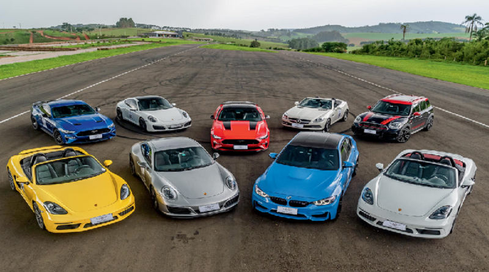
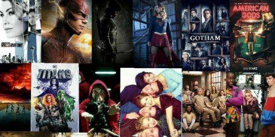
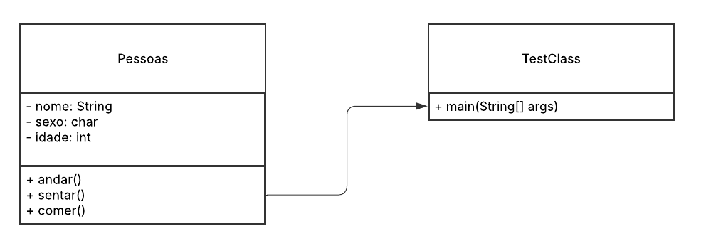
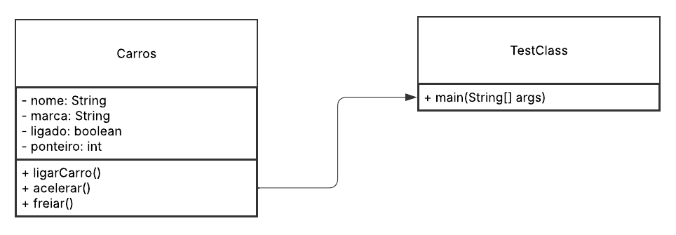

# Exercício 2
> 
<strong>Coletar 10 figuras contendo dois ou mais objetos de uma mesma classe. 
</strong>

| 
**Pessoas**
 | 
**Carros**
 | 
**Filmes**
 |
|-------------|------------|----------------|
|| | |

| **Instrumentos Musicais** | **Animais** | **Bolos** | **Celular** | **Jogo** | **Lugares** | |

## UML

> 
<strong>Modelar via UML ou outra ferramenta cada classe do item 1, com três métodos e três atributos. Sugestão de ferramenta </strong>

### Pessoas

### Carros

