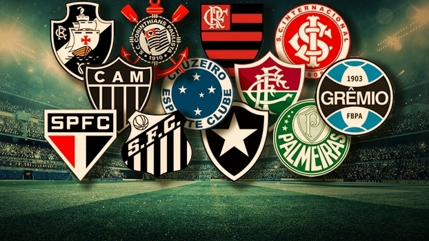
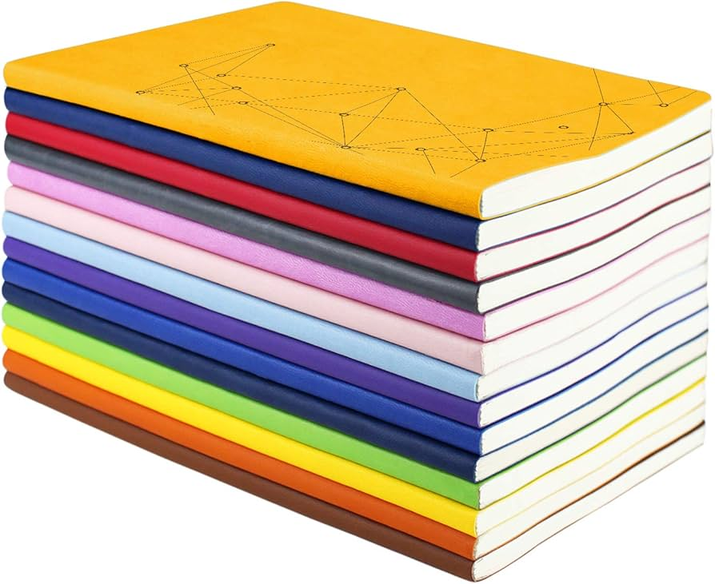
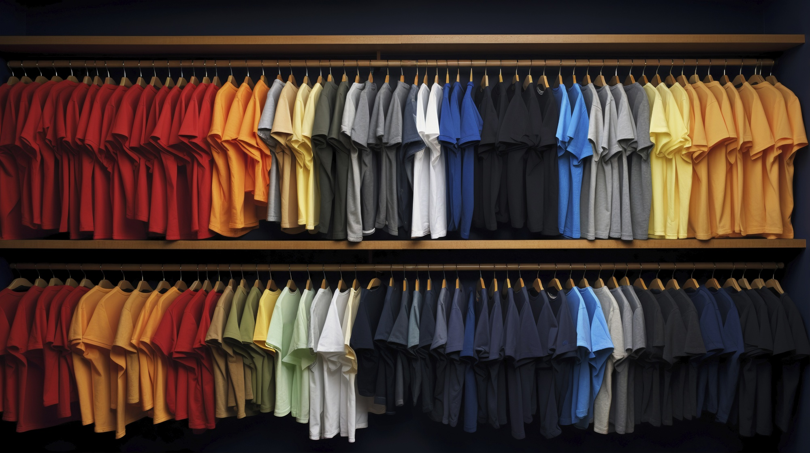
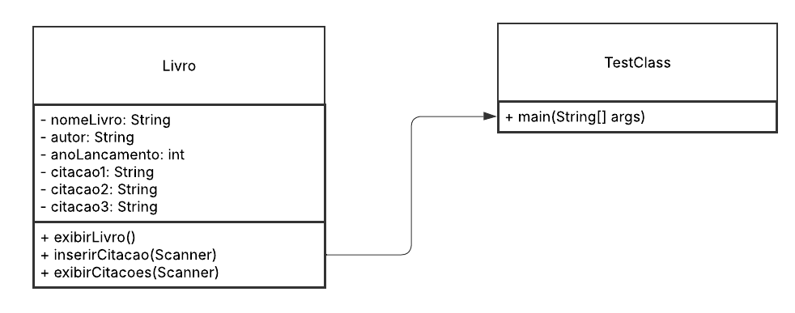
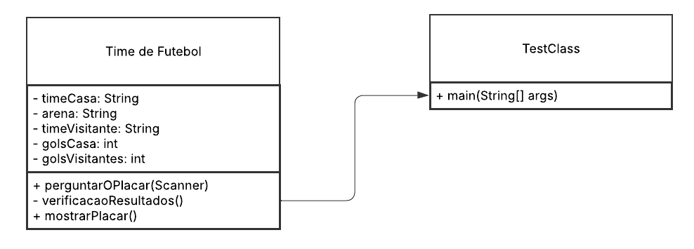
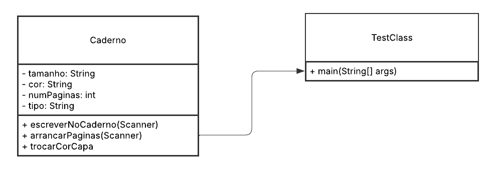
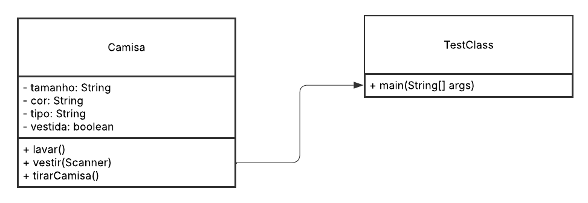

# Exercício 2
> 
<strong>Coletar 10 figuras contendo dois ou mais objetos de uma mesma classe. 
</strong>

| 
**Pessoas**
 | 
**Carros**
 | 
**Animais**
 |
|-------------|------------|----------------|
|| | |

| 
**Instrumentos Musicais**
 |
 **Bolos**
 | 
**Plantas**
 | 
|---------------------------|-------------|-----------|
|| |  |

| 
Livros
 | 
Times de Futebol
| 
Cadernos
 |
|-------------------------|----------|----------|
| |  | 

|
 Camisas
|
|------|
||

## 2 - UML

> 
<strong>Modelar via UML ou outra ferramenta cada classe do item 1, com três métodos e três atributos. Sugestão de ferramenta </strong>

### Pessoa

### Carro

### Animal

### Instrumento

### Bolo

### Planta

### Livro

### Time de Futebol

### Caderno

### Camisa

## 3 e 4 - Java

><strong> 3 - Implementar, usando a Linguagem Java, as classes modeladas no item 2.</strong>  
> <strong> 4 - Criar uma classe TestaClasse, um objeto de cada classe para teste.   - Evocar, pelo menos, dois métodos de cada classe.   - Criar menu em loop até o usuário optar por sair.</strong>
 

***Caminho do Java:*** LinguagemProgramacao1/Atividade 2/Java/TestClasseFiguras/src

