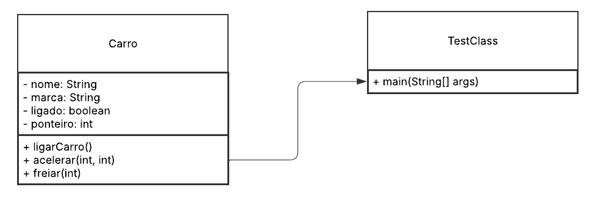
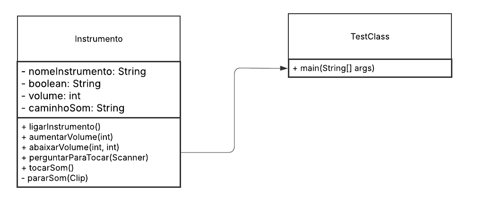
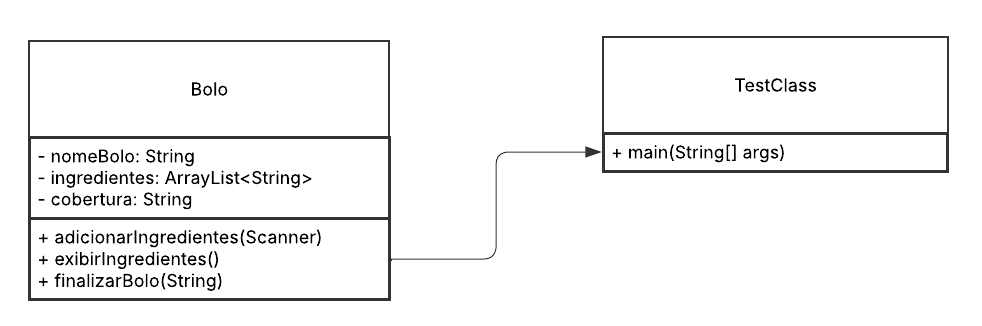

# Exercício 2
> 
<strong>Coletar 10 figuras contendo dois ou mais objetos de uma mesma classe. 
</strong>

| 
**Pessoas**
 | 
**Carros**
 | 
**Animais**
 |
|-------------|------------|----------------|
|| | |

| 
**Instrumentos Musicais**
 |
 **Bolos**
 | 
**Plantas**
 | **Celular** | **Jogo** | **Lugares** |
|---------------------------|-------------|-----------|-------------|----------|-------------|
||
## UML

> 
<strong>Modelar via UML ou outra ferramenta cada classe do item 1, com três métodos e três atributos. Sugestão de ferramenta </strong>

### Pessoa

### Carro

### Animal

### Instrumento

### Bolo

### Planta

